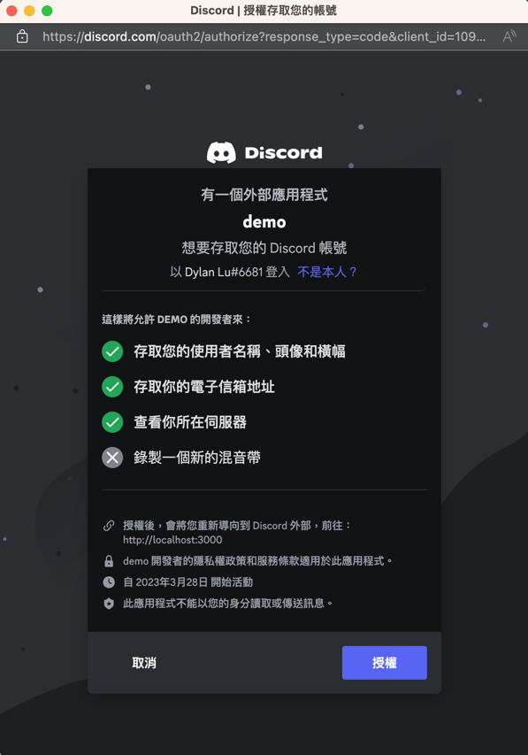

# 🔐 Streamlit OAuth

**A simple wrap for oauth2 authorization code grant flow using httpx_oauth**

## Installation

`pip install streamlit-oauth`

## Getting started

Set your callback url to `https://<YOUR ADDRESS>/component/streamlit_oauth.authorize_button/index.html`
```python
import streamlit as st
from dotenv import load_dotenv
load_dotenv()
AUTHORIZATION_URL = os.environ.get("AUTHORIZATION_URL")
TOKEN_URL = os.environ.get("TOKEN_URL")
REVOKE_URL = os.environ.get("REVOKE_URL")
CLIENT_ID = os.environ.get("CLIENT_ID")
CLIENT_SECRET = os.environ.get("CLIENT_SECRET")
REDIRECT_URI = os.environ.get("REDIRECT_URI")
SCOPE = os.environ.get("SCOPE")

oauth2 = OAuth2Component(CLIENT_ID, CLIENT_SECRET, AUTHORIZATION_URL, TOKEN_URL, TOKEN_URL, REVOKE_URL)

if 'token' not in st.session_state:
    result = oauth2.authorize_button("🔗 Authorize", REDIRECT_URI, SCOPE)
    if result:
  
    st.session_state.token = result.get('token')
    st.experimental_rerun()
else:
    token = st.session_state['token']
    st.json(token)
    if st.button("♻️ Refresh Token"):
    token = oauth2.refresh_token(token)
    st.session_state.token = token
    st.experimental_rerun()
```

## Demo





